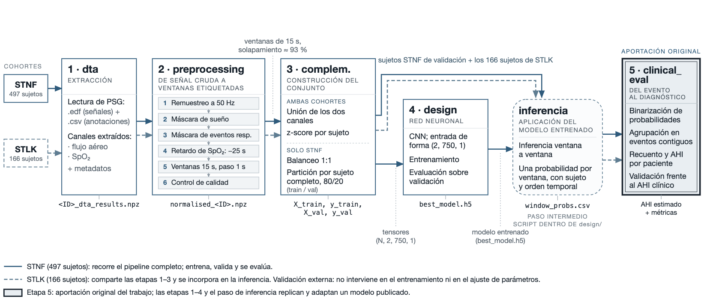

# Detección automática de apnea del sueño mediante CNN

En este trabajo se replica y adapta el modelo de Piorecky et al. (2021) para la detección de eventos de apnea obstructiva a partir de señales de flujo  (Airflow) y SpO₂,
con estimación del IAH por paciente.

**Autor:** Pablo E Ortega Ureña · **Tutor:** Rafael Larrosa Jiménez
Grado en Ingeniería de la Salud (mención Ingeniería Biomédica) — Universidad de Málaga

---

## 1. Contexto

La apnea obstructiva del sueño es un trastorno respiratorio caracterizado por episodios repetidos de colapso parcial o completo de la vía aérea superior durante el descanso nocturno. Su diagnóstico requiere una polisomnografía con anotación manual de los eventos, un procedimiento costoso y poco accesible. La aplicación de redes neuronales para detectarlas y supone un gran avance en la detección prematura de esta enfermedad.

**Diferencias respecto al original:**

| | Piorecky et al. (2021) | Este trabajo |
|---|---|---|
| Base de datos | M&I spol. s.r.o., Prague, Czech Republic | STAGES (NSRR), cohortes STNF y STLK |

Respecto al trabajo original se introducen tres cambios: se emplea la base de datos STAGES en lugar de la utilizada en el artículo, se adapta el preprocesado a la naturaleza de nuestra base de datos, y se añade una etapa de estimación del AHI por paciente que el modelo original no contempla.

**Motivación del trabajo:** 

Aplicar redes neuronales a un problema clínico real, infradiagnosticado que se puede beneficiar tanto de esta tecnología.

El paper original no reporta pruebas en distintas bases de datos con los pesos entrenados. Al evaluarlos directamente sobre STNF se obtuvo ROC-AUC 0,5613,frente a 0,9034 sobre los datos del propio paper.

**Objetivos de aprendizaje** 

Estructurar un proyecto en Python,adaptar datos de distinta naturaleza a otras estructuras, interpretar resultados del entrenamiento de cada configuración de la red,trabajar con supercomputador Picasso, gesetionado por el Servicio de Supercomputación y Bioinnovación (SCBI) de la Universidad de Málaga.

---

## 2. Datos

- **Fuente:** STAGES, a través de NSRR.
- **Cohortes:** STNF (entrenamiento, validación interna, test) y STLK
  (validación externa exclusivamente).
- **Señales:** flujo aéreo y SpO₂.

| Cohorte | Canal airflow | Sujetos iniciales | Tras preprocesado | Uso |
|---|---|---|---|---|
| STNF | `NasOr` | ~497 | ~445 | ~360 train / ~85 val / 40 test |
| STLK | `Nasal_Therm` | 166 | 113 | Solo validación externa |

## 3. Estructura

## 3. Agradecimientos

This research has been conducted using the STAGES - Stanford Technology, Analytics and Genomics in Sleep Resource funded by the Klarman Family Foundation. The investigators of the STAGES study contributed to the design and implementation of the STAGES cohort and/or provided data and/or collected biospecimens, but did not necessarily participate in the analysis or writing of this report. The full list of STAGES investigators can be found at the project website.

The National Sleep Research Resource was supported by the U.S. National Institutes of Health, National Heart Lung and Blood Institute (R24 HL114473, 75N92019R002).

## 4. Declaraciones

En el desarrollo del código de este proyecto se ha utilizado Claude (Anthropic) como herramienta de asistencia,

El trabajo se ha realizado módulo a módulo, revisando cada archivo antes de pasar al siguiente y sin omitir etapas intermedias del pipeline. Para cada decisión de implementación se ha entendido, contrastado alternativas y se ha valorado cuál se ajustaba mejor a los requisitos del problema, verificando el resultado con documentación y fuentes externas.

El diseño experimental, la elección de hiperparámetros, la interpretación de los resultados y las conclusiones metodológicas son responsabilidad del autor.